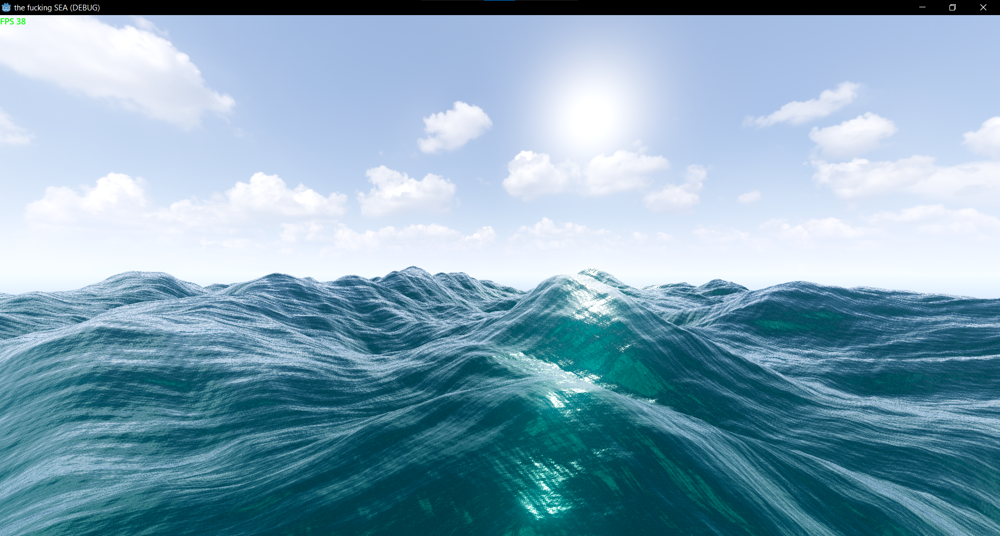

Water Simulation based on Acerola's video "How games fake water" and Chapter 1 of GPU Gems, made to work in godot 4.3.

Runs at around 40FPS on my 940MX at 1920p, with relatively high subdivision counts.
The project has manual LoD, which i may program in at a later stage (relatively unlikely since this is only a showcase, and not a game).
